# Analisis Buku Impor pada E-Commerce Periplus.com

**Makalah Tugas Data Science**

---

**Mata Kuliah:** Data Science (IF404)
**Program Studi:** PJJ Informatika S1
**Dosen Pengampu:** Ir. Ahmad Chusyairi, M.Com., CDS., IPM., ASEAN Eng
**Semester:** Genap 2025/2026

**Disusun oleh:**

| No. | Nama Lengkap | NIM |
|-----|------|-----|
| 1 | Sutan Gading Fadhillah Nasution | 250401020159 |
| 2 | Rina Mardiana | 250401020151 |

---

**Link Google Drive:**
*(Link akan dilampirkan setelah semua file diunggah)*

---

## Daftar Isi

- [BAB I - Pendahuluan](#bab-i---pendahuluan)
- [BAB II - Manajemen Data](#bab-ii---manajemen-data)
- [BAB III - Analisis dan Pembahasan](#bab-iii---analisis-dan-pembahasan)
- [BAB IV - Kesimpulan dan Saran](#bab-iv---kesimpulan-dan-saran)
- [Daftar Pustaka](#daftar-pustaka)

---

## BAB I - Pendahuluan

### 1.1 Latar Belakang

Industri e-commerce buku di Indonesia terus mengalami pertumbuhan signifikan. Platform seperti Periplus.com menjadi salah satu marketplace buku impor terbesar di Indonesia yang menyediakan ribuan judul dari berbagai penerbit internasional. Dengan banyaknya data produk yang tersedia, diperlukan pendekatan data science untuk mengekstrak insight yang bermanfaat bagi pelaku bisnis maupun konsumen.

Proyek ini menganalisis dataset buku impor dari Periplus.com menggunakan berbagai teknik data science, mulai dari manajemen data, asosiasi, korelasi, regresi, klasifikasi, clustering, hingga pembahasan mengenai big data dan perkembangannya.

### 1.2 Tujuan

1. Melakukan manajemen data yang mencakup pengumpulan, pembersihan, dan transformasi dataset buku dari Periplus.com.
2. Menganalisis pola asosiasi dan korelasi antar variabel dalam dataset.
3. Membangun model regresi untuk memprediksi harga buku.
4. Membangun model klasifikasi untuk mengkategorikan buku berdasarkan popularitas dan kategori harga.
5. Melakukan clustering untuk segmentasi buku.
6. Membahas konsep big data dan strategi scaling untuk dataset yang lebih besar.

### 1.3 Ruang Lingkup

- **Tema:** E-Commerce (Buku Impor)
- **Sumber Data:** Periplus.com (web scraping)
- **Dataset:** 1.322 buku dari 8 kategori
- **Tools:** Python (Pandas, scikit-learn, Matplotlib, Seaborn)

---

## BAB II - Manajemen Data

### 2.1 Metode Pengumpulan Data

Data dikumpulkan melalui proses web scraping dari situs Periplus.com menggunakan library Python `requests` dan `BeautifulSoup`. Proses scraping dilakukan dalam dua tahap:

1. **Scraping halaman katalog:** Mengambil informasi dasar produk dari halaman listing per kategori (judul, penulis, harga, binding, status stok).
2. **Scraping halaman detail:** Mengambil informasi tambahan dari halaman individual setiap produk (ISBN, penerbit, jumlah halaman, berat, tanggal terbit, jumlah review).

Scraping dilakukan terhadap 8 kategori buku dengan masing-masing 8 halaman per kategori, menghasilkan total 1.514 baris data mentah.

### 2.2 Sumber Data dan Kategori

| No | Kategori | Jumlah Buku |
|----|----------|-------------|
| 1 | Business & Self-Help | 191 |
| 2 | Fiction & Literature | 190 |
| 3 | Children's Books | 182 |
| 4 | Computer & IT | 177 |
| 5 | Biographies & Memoirs | 177 |
| 6 | Arts & Photography | 175 |
| 7 | Cooking & Food | 164 |
| 8 | Health & Fitness | 66 |

### 2.3 Atribut Data yang Dikumpulkan

Dataset mentah hasil scraping memiliki 16 kolom:

| No | Kolom | Tipe | Deskripsi |
|----|-------|------|-----------|
| 1 | title | string | Judul buku |
| 2 | author | string | Nama penulis |
| 3 | binding | string | Jenis cover (Paperback/Hardcover/Board Book) |
| 4 | in_stock | int | Ketersediaan stok (1=Ada, 0=Habis) |
| 5 | category | string | Kategori buku |
| 6 | product_url | string | URL halaman produk |
| 7 | price_idr | float | Harga jual saat ini (IDR) |
| 8 | original_price_idr | float | Harga asli sebelum diskon (IDR) |
| 9 | discount_percent | float | Persentase diskon |
| 10 | isbn | string | Nomor ISBN-13 |
| 11 | publisher | string | Nama penerbit |
| 12 | publication_date | string | Tanggal terbit |
| 13 | pages | int | Jumlah halaman |
| 14 | language | string | Bahasa buku |
| 15 | weight | float | Berat buku (kg) |
| 16 | review_count | int | Jumlah ulasan pelanggan |

### 2.4 Proses Pembersihan Data (*Data Cleaning*)

Proses pembersihan data meliputi langkah-langkah berikut:

1. **Penanganan missing values:** Kolom author, binding, language, dan publisher yang kosong diisi dengan nilai default. Kolom review_count yang kosong diisi dengan 0.
2. **Konversi tipe data:** Kolom numerik (price, pages, weight) dikonversi ke tipe float/int yang sesuai.
3. **Penghapusan duplikat:** Data duplikat berdasarkan kombinasi title, author, dan ISBN dihapus.
4. **Penghapusan data invalid:** Baris dengan harga tidak valid (kurang dari atau sama dengan 0) dihapus.
5. **Penghapusan outlier:** Buku dengan harga di atas Rp 2.000.000 dihapus karena merupakan outlier ekstrem yang mengganggu distribusi data.

Setelah pembersihan, dataset berisi **1.322 baris** data bersih.

### 2.5 Feature Engineering

Dari 16 kolom awal, ditambahkan 7 kolom baru hasil feature engineering:

| No | Fitur Baru | Rumus/Logika | Deskripsi |
|----|-----------|--------------|-----------|
| 1 | publication_year | Ekstrak tahun dari publication_date | Tahun terbit buku |
| 2 | book_age | 2026 - publication_year | Umur buku dalam tahun |
| 3 | price_per_page | price_idr / pages | Harga per halaman |
| 4 | popularity_score | review_count x (1 + discount_percent/100) | Skor popularitas |
| 5 | is_new_release | 1 jika publication_year >= 2024 | Flag buku baru |
| 6 | price_category | Berdasarkan rentang harga | Budget/Mid-range/Premium/Luxury |
| 7 | has_discount | 1 jika discount_percent > 0 | Flag ada diskon |

**Kategori harga:**
- Budget: Rp 0 - Rp 150.000
- Mid-range: Rp 150.001 - Rp 250.000
- Premium: Rp 250.001 - Rp 400.000
- Luxury: Rp 400.001 ke atas

Total dataset akhir: **1.322 baris x 23 kolom**.

### 2.6 Statistik Deskriptif

| Statistik | Harga (Rp) | Halaman | Berat (kg) | Review |
|-----------|-----------|---------|------------|--------|
| Mean | 376.616 | 258 | 0,47 | 0,31 |
| Median | 299.000 | 240 | 0,36 | 0 |
| Std Dev | 263.249 | 169 | 0,41 | 1,01 |
| Min | 29.400 | 0 | 0 | 0 |
| Max | 1.975.000 | 1.472 | 3,95 | 20 |

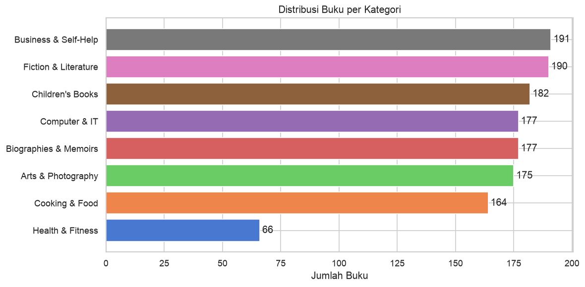
*Gambar 1. Distribusi Buku per Kategori*

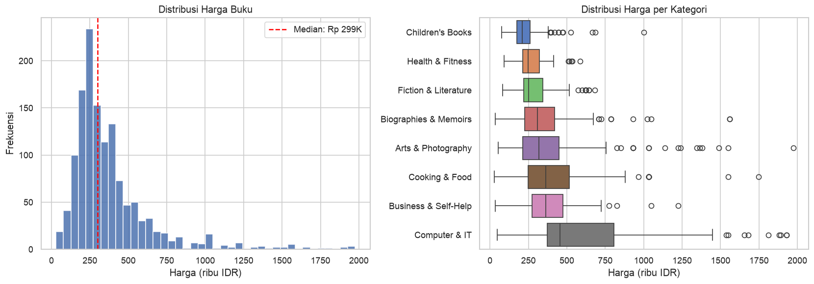
*Gambar 2. Distribusi Harga Buku dan Boxplot per Kategori*

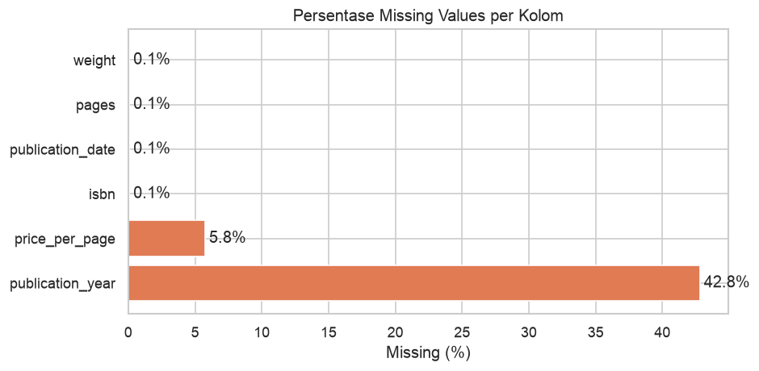
*Gambar 3. Persentase Missing Values per Kolom*

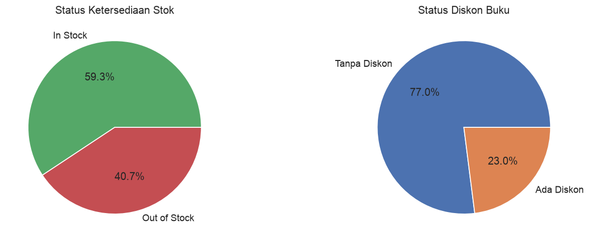
*Gambar 4. Status Ketersediaan Stok dan Diskon*

### 2.7 Temuan Awal

- Sebanyak 784 buku (59,3%) tersedia dalam stok.
- Sebanyak 304 buku (23,0%) memiliki diskon.
- Binding didominasi oleh Paperback (876 buku, 66,3%) diikuti Hardcover (390 buku, 29,5%).
- Terdapat 389 penerbit unik, dengan Tuttle Publishing sebagai penerbit terbanyak (97 buku).

---

## BAB III - Analisis dan Pembahasan

### 3.1 Asosiasi dan Korelasi Data

#### 3.1.1 Analisis Korelasi

Korelasi Pearson digunakan untuk mengukur kekuatan dan arah hubungan linier antara dua variabel numerik. Nilai korelasi berkisar dari -1 (korelasi negatif sempurna) hingga +1 (korelasi positif sempurna).

Hasil analisis korelasi pada dataset:

| Pasangan Variabel | Pearson r | Interpretasi |
|-------------------|-----------|--------------|
| Harga vs Berat | 0,6518 | Korelasi positif kuat |
| Harga vs Halaman | 0,2972 | Korelasi positif lemah |
| Halaman vs Berat | 0,2835 | Korelasi positif lemah |
| Harga Jual vs Harga Asli | ~0,99 | Korelasi positif sangat kuat |

#### 3.1.2 Interpretasi Korelasi

- Buku yang lebih berat cenderung lebih mahal (r = 0,65). Ini masuk akal karena buku berat umumnya memiliki kualitas cetak yang lebih baik (kertas tebal, full color) yang menambah biaya produksi.
- Korelasi halaman terhadap harga lebih lemah (r = 0,30), menunjukkan bahwa jumlah halaman bukan satu-satunya penentu harga. Faktor lain seperti penerbit, kategori, dan kualitas cetak juga berperan.
- Harga jual dan harga asli berkorelasi hampir sempurna, menandakan diskon dihitung secara konsisten dari harga asli.

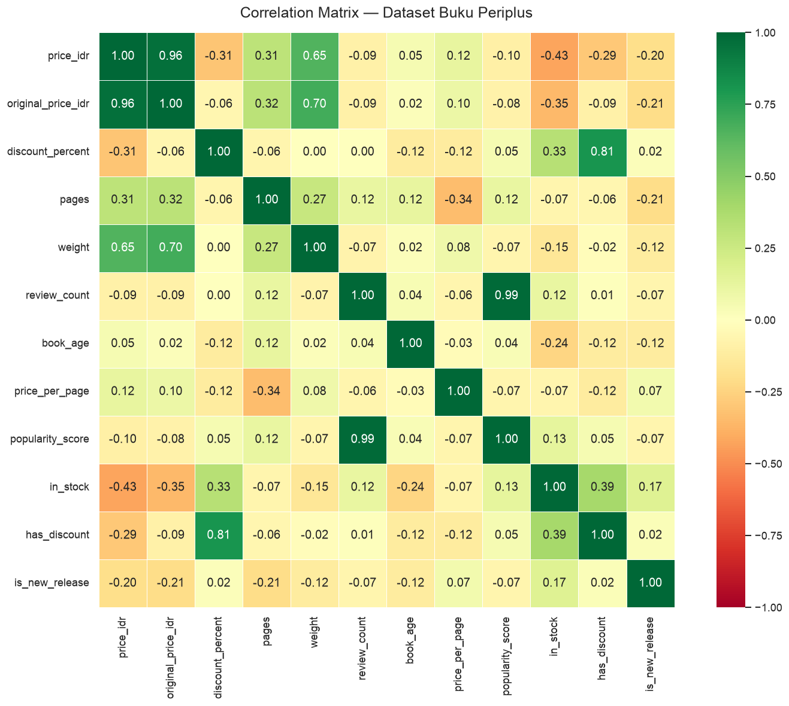
*Gambar 5. Correlation Matrix Dataset Buku Periplus*

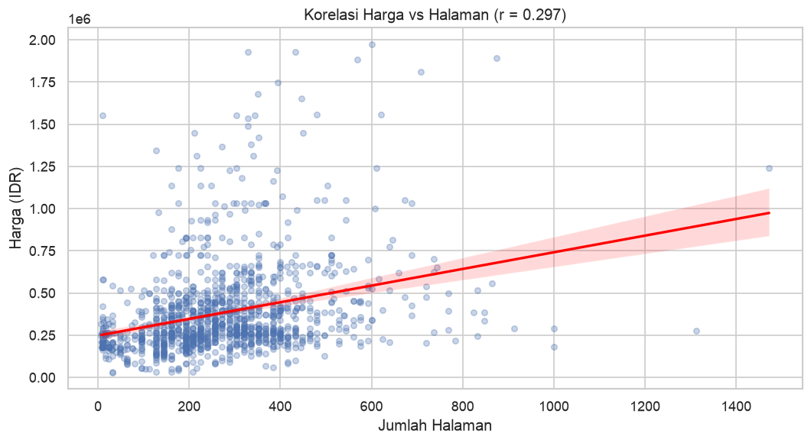
*Gambar 6. Scatter Plot Korelasi Harga vs Jumlah Halaman*

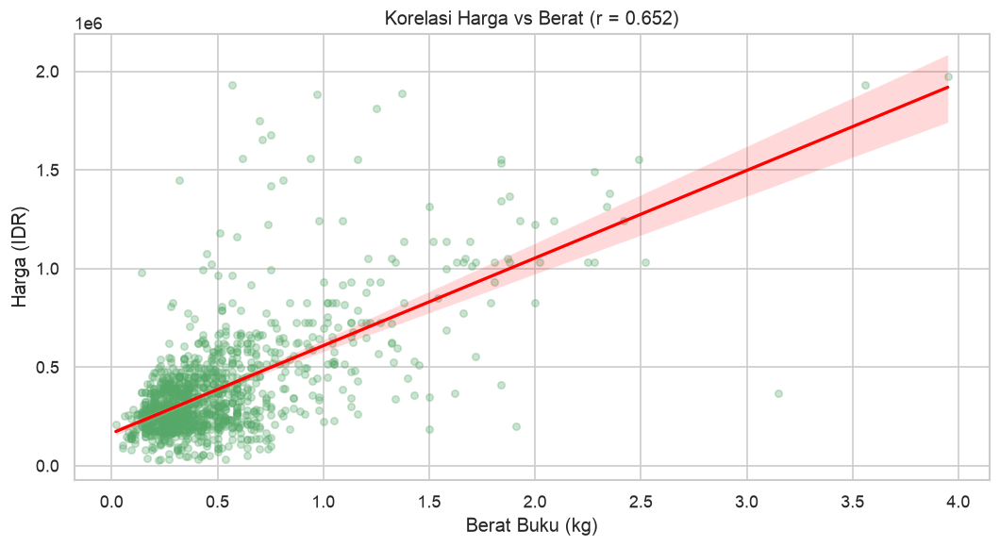
*Gambar 7. Scatter Plot Korelasi Harga vs Berat Buku*

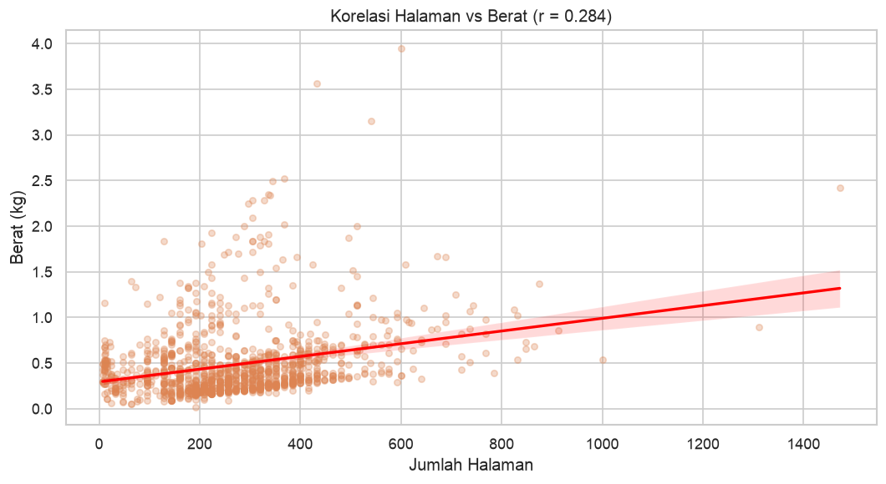
*Gambar 8. Scatter Plot Korelasi Halaman vs Berat*

#### 3.1.3 Analisis Asosiasi

Analisis asosiasi dilakukan untuk menemukan pola hubungan antar variabel kategorikal dalam dataset.

##### Co-occurrence: Category x Publisher

Analisis co-occurrence mengungkapkan pola spesialisasi penerbit terhadap kategori tertentu:

- **Tuttle Publishing** mendominasi kategori Children's Books dan Cooking & Food, menunjukkan spesialisasi pada buku-buku Asia/Jepang.
- **Penguin Books Ltd** tersebar merata di Fiction & Literature dan Biographies & Memoirs.
- **Viz Media** hampir eksklusif di Fiction & Literature (manga/komik).

##### Category x Binding

Distribusi jenis binding bervariasi antar kategori:
- **Paperback** mendominasi hampir semua kategori (65-80%).
- **Arts & Photography** dan **Cooking & Food** memiliki proporsi Hardcover lebih tinggi (~35-40%) karena buku-buku visual memerlukan kualitas cetak yang lebih baik.
- **Board Book** hanya ditemukan di Children's Books.

##### Price Category x Discount

Analisis asosiasi antara kategori harga dan status diskon menunjukkan:
- Buku kategori **Budget** dan **Mid-range** lebih sering mendapat diskon dibandingkan buku **Premium** dan **Luxury**.
- Ini mengindikasikan strategi diskon Periplus yang lebih menargetkan buku-buku harga menengah ke bawah untuk meningkatkan volume penjualan.

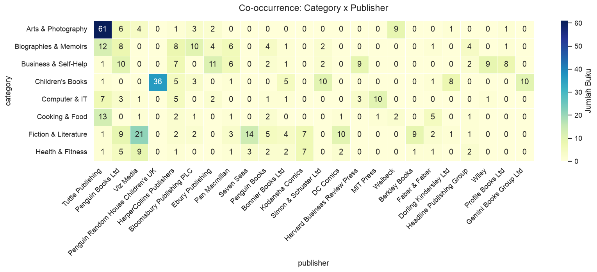
*Gambar 9. Heatmap Co-occurrence Category x Publisher*

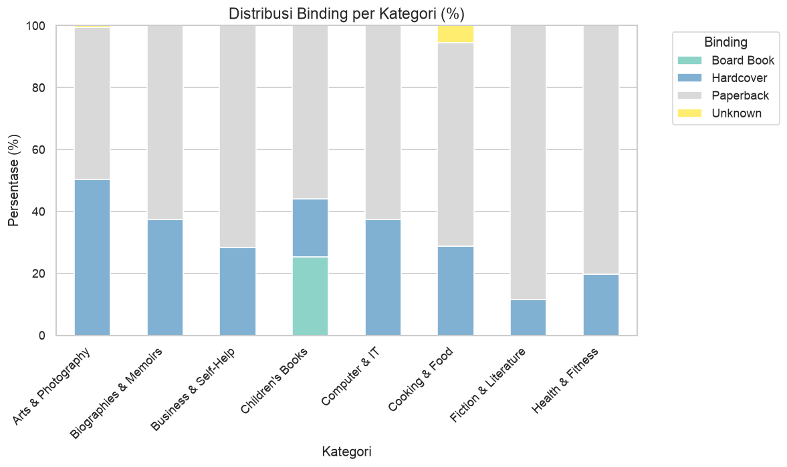
*Gambar 10. Distribusi Binding per Kategori*

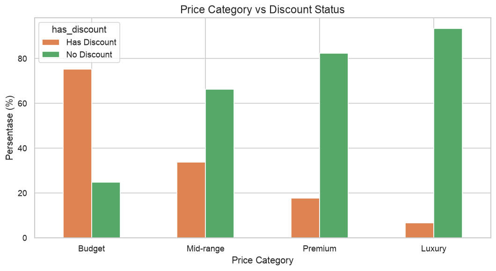
*Gambar 11. Asosiasi Price Category vs Discount Status*

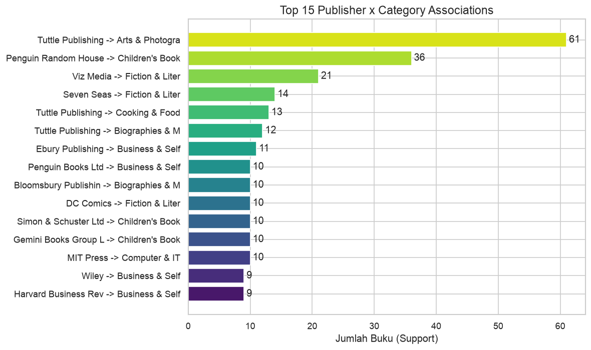
*Gambar 12. Top 15 Publisher x Category Associations*

---

### 3.2 Analisis Regresi

#### 3.2.1 Tujuan

Memprediksi **harga buku** (`price_idr`) berdasarkan fitur-fitur yang tersedia. Model regresi ini dapat digunakan untuk:
- Estimasi harga buku baru yang belum memiliki harga.
- Deteksi anomali harga (harga tidak wajar).
- Strategi pricing untuk penerbit dan seller.

#### 3.2.2 Persiapan Data

- Data yang digunakan: buku dengan fitur lengkap (pages, weight, book_age tersedia).
- Fitur kategorikal (category, publisher, binding) di-encode menggunakan Label Encoding.
- Split data: 80% training, 20% testing (random_state=42).

**Fitur yang digunakan:** pages, weight, book_age, review_count, discount_percent, category, publisher, binding.

#### 3.2.3 Model dan Hasil

##### Linear Regression

| Metrik | Nilai |
|--------|-------|
| R-squared (R2) | 0,6270 |
| RMSE | Rp 148.121 |
| MAE | Rp 99.181 |

Linear Regression menghasilkan R2 = 0,63 yang berarti model mampu menjelaskan 63% variasi harga buku.

##### Random Forest Regressor

| Metrik | Nilai |
|--------|-------|
| R-squared (R2) | 0,5714 |
| RMSE | Rp 158.769 |
| MAE | Rp 83.122 |

Random Forest menghasilkan MAE yang lebih rendah (Rp 83.122 vs Rp 99.181), menunjukkan prediksi yang lebih konsisten meskipun R2 sedikit lebih rendah.

#### 3.2.4 Feature Importance

Berdasarkan analisis Random Forest, fitur paling penting untuk prediksi harga:
1. **publisher** - Penerbit sangat menentukan harga (buku akademik vs buku populer).
2. **weight** - Berat buku berkorelasi kuat dengan harga.
3. **pages** - Jumlah halaman mempengaruhi biaya produksi.
4. **category** - Kategori buku menentukan segmen harga.

#### 3.2.5 Evaluasi

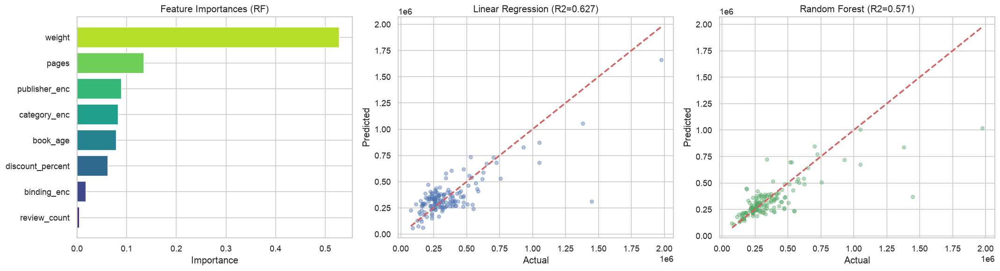
*Gambar 13. Feature Importance dan Actual vs Predicted (Linear Regression & Random Forest)*

Kedua model menghasilkan performa yang cukup baik dengan error rata-rata Rp 83.000 - Rp 99.000. Mengingat rentang harga buku dari Rp 29.400 hingga Rp 1.975.000, error ini masih dalam batas yang dapat diterima. Model dapat ditingkatkan dengan menambahkan fitur tambahan seperti rating buku atau data penjualan.

---

### 3.3 Klasifikasi Data

#### 3.3.1 Tujuan

Membangun model klasifikasi untuk tiga use case yang bermanfaat bagi e-commerce:

1. **Klasifikasi Popularitas** - Memprediksi apakah buku akan populer atau tidak.
2. **Klasifikasi Kategori Harga** - Mengkategorikan buku ke dalam segmen harga.
3. **Klasifikasi Diskon** - Memprediksi apakah buku akan mendapat diskon.

#### 3.3.2 Klasifikasi Popularitas Buku

**Target:** Popular (review_count > 0) vs Unpopular (review_count = 0)
**Model:** Random Forest Classifier (100 trees, max_depth=15)

| Metrik | Nilai |
|--------|-------|
| Accuracy | 82,26% |
| F1-Score | 0,1754 |

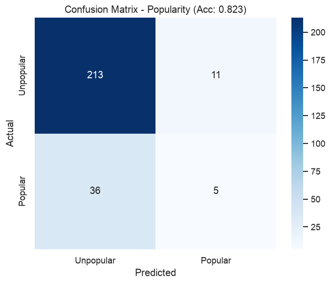
*Gambar 14. Confusion Matrix Klasifikasi Popularitas*

F1-Score yang rendah disebabkan oleh ketidakseimbangan kelas (hanya 15,4% buku yang memiliki review > 0). Model cenderung memprediksi "Unpopular" karena kelas mayoritas. Meskipun accuracy tinggi, model ini perlu perbaikan dengan teknik oversampling (SMOTE) atau threshold adjustment untuk meningkatkan recall pada kelas "Popular".

#### 3.3.3 Klasifikasi Price Category

**Target:** Budget / Mid-range / Premium / Luxury (multi-class)
**Model:** Random Forest Classifier

| Metrik | Nilai |
|--------|-------|
| Accuracy | 68,68% |

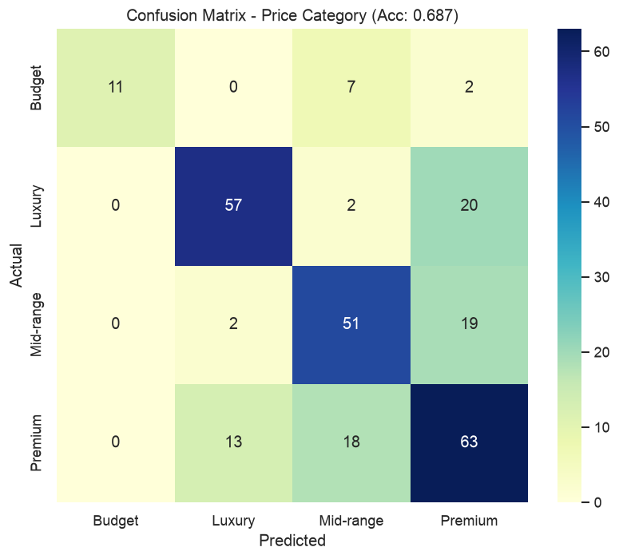
*Gambar 15. Confusion Matrix Klasifikasi Price Category*

Model mampu mengklasifikasikan kategori harga dengan akurasi 68,7%. Kategori **Premium** dan **Luxury** lebih mudah diprediksi karena fitur fisik (pages, weight) yang berbeda signifikan. Kategori **Budget** dan **Mid-range** sering tertukar karena overlap pada fitur-fiturnya.

#### 3.3.4 Klasifikasi Has Discount

**Target:** Has Discount (1) vs No Discount (0)
**Model:** Random Forest Classifier

| Metrik | Nilai |
|--------|-------|
| Accuracy | 79,25% |
| F1-Score | 0,3956 |

Model cukup baik dalam memprediksi buku tanpa diskon, namun kurang akurat untuk memprediksi buku yang akan mendapat diskon. Ini menunjukkan bahwa keputusan diskon di Periplus tidak sepenuhnya bergantung pada fitur buku itu sendiri, melainkan juga dipengaruhi oleh faktor eksternal seperti strategi marketing dan event promosi.

---

### 3.4 Clustering Data

#### 3.4.1 Tujuan

Melakukan segmentasi buku menggunakan K-Means Clustering untuk mengidentifikasi kelompok-kelompok buku dengan karakteristik serupa. Hasil clustering dapat digunakan untuk strategi marketing, inventory management, dan sistem rekomendasi.

#### 3.4.2 Metode

- **Algoritma:** K-Means Clustering
- **Fitur:** price_idr, pages, weight, review_count, discount_percent
- **Preprocessing:** StandardScaler untuk normalisasi fitur
- **Penentuan K:** Elbow Method dan Silhouette Score

#### 3.4.3 Penentuan Jumlah Cluster

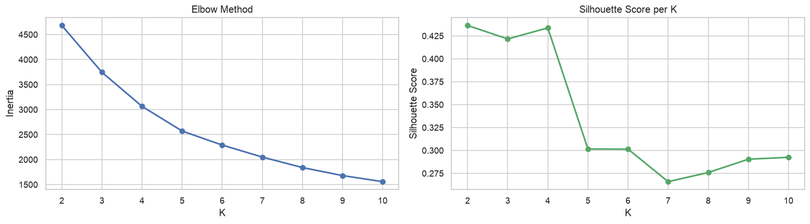
*Gambar 16. Elbow Method dan Silhouette Score*

Berdasarkan Elbow Method dan Silhouette Score, dipilih **K=4** sebagai jumlah cluster optimal dengan Silhouette Score = 0,4337.

#### 3.4.4 Profil Cluster

| Cluster | Harga (Rp) | Halaman | Berat (kg) | Review | Diskon (%) | Label |
|---------|-----------|---------|------------|--------|------------|-------|
| 0 | 328.957 | 241 | ~0 | 0 | 2% | Standard Books |
| 1 | 879.317 | 430 | 1,0 | 0 | 2% | Premium Heavy Books |
| 2 | 299.791 | 343 | ~0 | 3 | 6% | Popular Reviewed Books |
| 3 | 171.522 | 243 | 1,0 | 0 | 52% | Discounted Books |

##### Interpretasi Cluster

- **Cluster 0 (Standard Books):** Buku dengan harga menengah, ukuran standar, tanpa review dan tanpa diskon. Ini merupakan kelompok terbesar yang mewakili buku-buku umum.
- **Cluster 1 (Premium Heavy Books):** Buku mahal dengan halaman banyak dan berat. Biasanya buku referensi, textbook, atau coffee table books.
- **Cluster 2 (Popular Reviewed Books):** Buku dengan harga menengah yang memiliki review dari pelanggan. Buku-buku ini cenderung populer dan sedikit lebih sering mendapat diskon.
- **Cluster 3 (Discounted Books):** Buku dengan diskon besar (rata-rata 52%). Harganya paling murah karena sudah didiskon signifikan.

#### 3.4.5 Visualisasi Cluster

Visualisasi cluster dilakukan menggunakan PCA (Principal Component Analysis) untuk mereduksi dimensi dari 5 fitur ke 2 komponen utama. Scatter plot menunjukkan pemisahan yang cukup jelas antar cluster, terutama untuk Cluster 1 (Premium) dan Cluster 3 (Discounted).

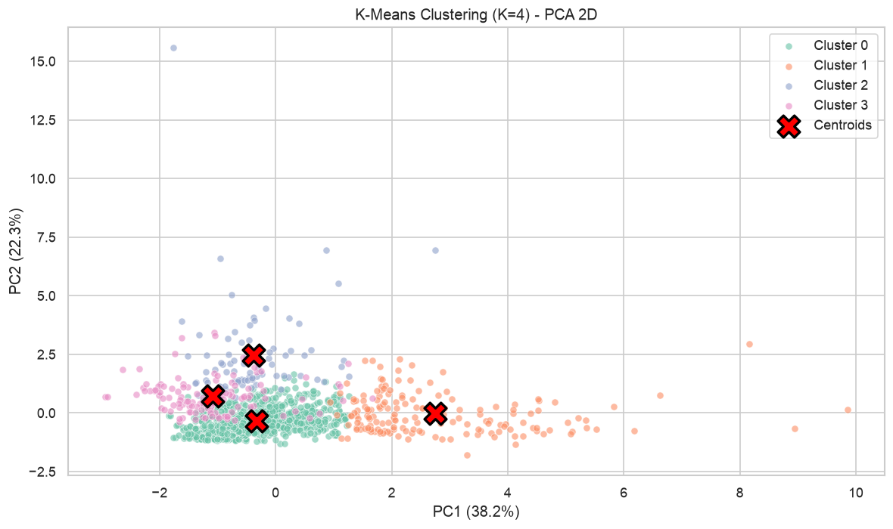
*Gambar 17. K-Means Clustering - PCA 2D Projection*

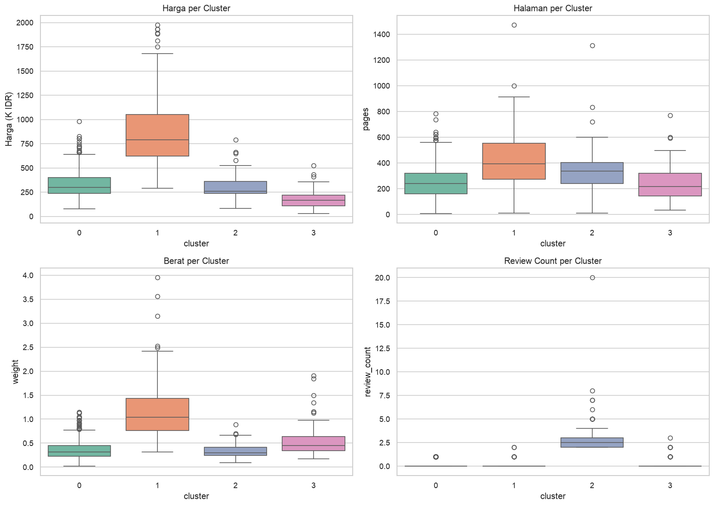
*Gambar 18. Distribusi Fitur per Cluster*

#### 3.4.6 Manfaat Clustering

1. **Segmentasi pelanggan:** Targetkan promo sesuai preferensi cluster (misal: diskon untuk pelanggan Cluster 0 agar menjadi seperti Cluster 3).
2. **Inventory management:** Alokasi stok berdasarkan demand per cluster.
3. **Sistem rekomendasi:** Rekomendasikan buku dari cluster yang sama kepada pelanggan.
4. **Pricing strategy:** Optimasi harga berdasarkan karakteristik cluster.

---

### 3.5 Big Data dan Perkembangannya

#### 3.5.1 Definisi Big Data

Big Data mengacu pada kumpulan data yang sangat besar, kompleks, dan berkembang cepat sehingga tidak dapat diproses menggunakan metode tradisional. Big Data dicirikan dengan **5V**:

| Karakteristik | Deskripsi | Contoh pada Dataset Buku |
|---------------|-----------|--------------------------|
| **Volume** | Ukuran data sangat besar | Jutaan buku dari ribuan toko online |
| **Velocity** | Kecepatan data masuk/berubah | Real-time price updates, stock changes |
| **Variety** | Beragam format data | Teks, gambar cover, review, rating |
| **Veracity** | Keakuratan dan kepercayaan data | Missing values, data tidak konsisten |
| **Value** | Nilai bisnis dari insight data | Pricing strategy, recommendation engine |

#### 3.5.2 Perbandingan Dataset Saat Ini vs Big Data

| Aspek | Dataset Saat Ini | Skenario Big Data |
|-------|-----------------|-------------------|
| Jumlah data | 1.322 buku | Jutaan hingga miliaran buku |
| Ukuran file | ~1 MB | Terabyte hingga Petabyte |
| Processing | Pandas (single machine) | Apache Spark / Dask (distributed) |
| Storage | File CSV | Data Lake (Parquet, Delta Lake) |
| ML Training | scikit-learn (menit) | Spark MLlib (jam) |
| Infrastructure | Laptop | Cloud cluster (AWS/GCP/Azure) |

#### 3.5.3 Tools dan Teknologi Big Data

##### Storage dan Processing

| Tool | Fungsi | Kapan Digunakan |
|------|--------|-----------------|
| **Hadoop HDFS** | Distributed file storage | Dataset > 100GB, perlu redundancy |
| **Apache Spark** | Distributed data processing | Analisis paralel, ML pada big data |
| **Dask** | Python parallel computing | Pandas-like API untuk data besar |
| **Apache Kafka** | Real-time data streaming | Live price updates, event processing |

##### Database

| Tool | Tipe | Use Case |
|------|------|----------|
| **PostgreSQL** | Relational (SQL) | Structured data, ACID compliance |
| **MongoDB** | Document (NoSQL) | Flexible schema, JSON-like data |
| **Elasticsearch** | Search engine | Full-text search, real-time analytics |
| **Google BigQuery** | Cloud data warehouse | Serverless analytics, SQL on petabytes |

##### Cloud Platforms

| Platform | Services |
|----------|----------|
| **AWS** | S3, Redshift, EMR, SageMaker |
| **Google Cloud** | BigQuery, Dataflow, Vertex AI |
| **Azure** | Data Lake, Synapse, Databricks |

#### 3.5.4 Strategi Scaling

Jika dataset buku perlu di-scale ke jutaan data, berikut strategi yang dapat diterapkan:

| Task | Pendekatan Saat Ini | Pendekatan Big Data |
|------|---------------------|---------------------|
| Data Loading | `pd.read_csv()` | `dask.dataframe.read_csv()` atau Spark |
| Data Processing | `df.groupby().mean()` | Lazy evaluation + parallel execution |
| Machine Learning | scikit-learn (single machine) | Spark MLlib atau Dask-ML |
| Storage | File CSV | Format Parquet (columnar, compressed) |
| Database | SQLite / CSV | PostgreSQL, BigQuery, MongoDB |
| Visualization | Matplotlib (in-memory) | Sampling + distributed visualization |

#### 3.5.5 Tantangan Big Data

| Tantangan | Deskripsi | Solusi |
|-----------|-----------|-------|
| Storage Cost | Data besar memerlukan biaya penyimpanan tinggi | Compression, tiered storage, data lifecycle |
| Processing Time | Query lambat pada jutaan baris | Indexing, partitioning, caching |
| Data Quality | Missing values, duplikat, inkonsistensi | Data validation pipeline, cleaning automation |
| Privacy & Security | Perlindungan data pribadi, kepatuhan GDPR | Encryption, access control, anonymization |
| Real-time Processing | Kebutuhan latency rendah | Stream processing (Apache Kafka, Flink) |

#### 3.5.6 Tren Perkembangan Big Data (2024-2026)

1. **Integrasi AI/ML:** AutoML untuk seleksi model otomatis, Large Language Models (LLM) untuk analisis data berbasis bahasa alami, MLOps untuk production ML pipelines.
2. **Real-time Analytics:** Pergeseran dari batch processing ke streaming, arsitektur event-driven, pengambilan keputusan dengan latency rendah.
3. **Data Lakehouse:** Kombinasi Data Lake dan Data Warehouse menggunakan Delta Lake dan Apache Iceberg, mendukung transaksi ACID pada data lake.
4. **Serverless dan Managed Services:** Mengurangi operational overhead dengan model pay-per-use (BigQuery, Snowflake, Databricks).
5. **Data Governance dan Privacy:** Data cataloging, lineage tracking, compliance automation (GDPR, CCPA), serta federated learning untuk menjaga privasi.

---

## BAB IV - Kesimpulan dan Saran

### 4.1 Kesimpulan

Proyek ini telah berhasil menganalisis dataset 1.322 buku impor dari Periplus.com menggunakan 7 teknik data science:

| No | Teknik | Hasil Utama |
|----|--------|-------------|
| 1 | **Manajemen Data** | Dataset bersih 1.322 baris x 23 kolom dari 8 kategori buku |
| 2 | **Korelasi** | Korelasi kuat antara harga dan berat buku (r = 0,65) |
| 3 | **Asosiasi** | Pola spesialisasi publisher, dominasi Paperback, strategi diskon berbasis harga |
| 4 | **Regresi** | Prediksi harga dengan MAE Rp 83.122 (Random Forest) |
| 5 | **Klasifikasi** | Accuracy 68-82% untuk tiga use case klasifikasi |
| 6 | **Clustering** | 4 segmen buku: Standard, Premium, Popular, Discounted |
| 7 | **Big Data** | Pemahaman tools, arsitektur, dan strategi scaling |

### 4.2 Manfaat bagi E-Commerce

1. **Pricing Strategy:** Model regresi dapat digunakan untuk estimasi harga optimal dan deteksi anomali harga.
2. **Targeted Marketing:** Segmentasi buku berdasarkan clustering memungkinkan kampanye marketing yang lebih tepat sasaran.
3. **Inventory Management:** Prediksi popularitas buku membantu optimasi alokasi stok.
4. **Recommendation System:** Pola asosiasi publisher-category dapat digunakan untuk rekomendasi produk.

### 4.3 Saran Pengembangan

1. Menambahkan data rating dan sentiment analysis dari review pelanggan untuk meningkatkan akurasi model.
2. Mengimplementasikan teknik oversampling (SMOTE) untuk mengatasi ketidakseimbangan kelas pada klasifikasi popularitas.
3. Mengeksplorasi algoritma deep learning untuk prediksi harga yang lebih akurat.
4. Membangun pipeline data otomatis untuk scraping dan analisis secara berkala.
5. Mengintegrasikan hasil analisis ke dalam dashboard interaktif untuk monitoring real-time.

---

## Daftar Pustaka

1. McKinney, W. (2017). *Python for Data Analysis: Data Wrangling with Pandas, NumPy, and IPython*. O'Reilly Media.
2. Geron, A. (2022). *Hands-On Machine Learning with Scikit-Learn, Keras, and TensorFlow*. O'Reilly Media.
3. Han, J., Kamber, M., & Pei, J. (2012). *Data Mining: Concepts and Techniques*. Morgan Kaufmann.
4. Provost, F., & Fawcett, T. (2013). *Data Science for Business*. O'Reilly Media.
5. Dean, J. (2014). *Big Data, Data Mining, and Machine Learning*. John Wiley & Sons.
6. Periplus.com. (2026). Katalog Buku Online. https://www.periplus.com
7. scikit-learn Documentation. (2026). https://scikit-learn.org/stable/
8. Pandas Documentation. (2026). https://pandas.pydata.org/docs/
