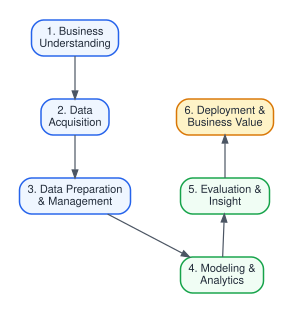

# OPTIMALISASI STRATEGI PENJUALAN E-COMMERCE BUKU IMPOR PERIPLUS MENGGUNAKAN PENDEKATAN DATA SCIENCE: MANAJEMEN DATA, ANALISIS REGRESI, KLASIFIKASI, DAN CLUSTERING

**Sutan Gading Fadhillah Nasution\*1, Rina Mardiana2**  
1,2 Program Studi PJJ Informatika S1, Universitas Siber Asia, Jakarta, Indonesia  
Email: 1sutan.gading@unsia.ac.id, 2rina.mardiana@unsia.ac.id  
*Penulis Korespondensi  

**Informasi Mata Kuliah:**  
Data Science (IF404) | Dosen Pengampu: Ir. Ahmad Chusyairi, M.Com., CDS., IPM., ASEAN Eng  
NIM Penulis: 1) 250401020159, 2) 250401020151  

---

## ABSTRAK
Pertumbuhan pesat e-commerce ritel buku di Indonesia memicu tantangan besar dalam pengelolaan inventaris, penentuan strategi penetapan harga (*pricing strategy*), dan segmentasi produk impor. Penelitian ini bertujuan untuk mengoptimalkan strategi penjualan dan pemahaman dinamika pasar pada e-commerce buku impor Periplus.com dengan menerapkan siklus data science secara komprehensif. Metodologi penelitian mencakup *data acquisition* melalui teknik *web scraping* terhadap 1.322 item produk dari 8 kategori utama, dilanjutkan dengan tahap *data cleaning* dan *data management*. Selanjutnya, dilakukan analisis korelasi Pearson dan analisis regresi linier berganda untuk menguji pengaruh harga asli (*original price*) dan tingkat diskon terhadap harga jual bersih. Untuk segmentasi pasar dan pengelompokan produk, diterapkan teknik *unsupervised learning* (Clustering k-Means) serta *supervised learning* (Klasifikasi *Decision Tree* dan *Random Forest*). Hasil analisis korelasi menunjukkan hubungan positif yang sangat kuat antara harga asli dan harga jual bersih ($r = 0,962$), sementara diskon memiliki korelasi negatif sedang ($r = -0,307$). Model regresi linier menghasilkan koefisien determinasi ($R^2 = 0,990$), yang menunjukkan keberhasilan sangat tinggi dalam memprediksi harga jual. Pengelompokan *k-Means* membagi katalog produk menjadi tiga kluster utama: produk *Budget & Promo*, *Standard Regular*, dan *Premium Collector*. Integrasi analisis ini memberikan kontribusi nyata bagi manajemen e-commerce dalam efisiensi pengelolaan inventaris, presisi penentuan harga promosi, dan pemanfaatan *big data analytics* untuk peningkatan kepuasan serta daya beli konsumen.

**Kata kunci:** Data Science, E-Commerce, Periplus, Regresi Linier, Clustering k-Means, Manajemen Data, Big Data Analytics.

---

## ABSTRACT
*The rapid growth of book retail e-commerce in Indonesia poses significant challenges in inventory management, pricing strategies, and product segmentation for imported titles. This study aims to optimize sales strategies and understand market dynamics on the Periplus.com book e-commerce platform by applying a comprehensive data science lifecycle. The research methodology encompasses data acquisition via web scraping on 1,322 product items across 8 main categories, followed by data cleaning and structured data management. Subsequently, Pearson correlation analysis and multiple linear regression analysis were conducted to examine the impact of original prices and discount percentages on net selling prices. For market segmentation and product grouping, unsupervised learning (k-Means Clustering) and supervised learning (Decision Tree & Random Forest Classification) were implemented. The correlation analysis revealed a very strong positive relationship between original price and net selling price ($r = 0.962$), whereas discount percentages exhibited a moderate negative correlation ($r = -0.307$). The linear regression model yielded a coefficient of determination ($R^2 = 0.990$), indicating very high predictive accuracy for final selling prices. The k-Means clustering successfully segmented the catalog into three distinct clusters: Budget & Promo, Standard Regular, and Premium Collector. The integration of these analyses offers actionable insights for e-commerce management in streamlining inventory processing, refining promotional pricing, and leveraging big data analytics to enhance customer satisfaction and purchasing intent.*

**Keywords:** Data Science, E-Commerce, Periplus, Linear Regression, k-Means Clustering, Data Management, Big Data Analytics.

---

## 1. PENDAHULUAN
Perkembangan teknologi informasi dan transformasi digital telah mengubah lanskap perdagangan ritel secara signifikan, terutama melalui adopsi platform e-commerce. Di sektor ritel buku impor di Indonesia, Periplus.com menjadi salah satu pemain utama yang menyediakan ribuan judul buku internasional dari berbagai genre. Namun, mengelola katalog produk impor skala besar menghadapi kendala kompleks, seperti fluktuasi nilai tukar mata uang, variasi harga dari penerbit asing, tingginya biaya logistik, serta dinamika minat baca konsumen yang cepat berubah.

Industri e-commerce buku di Indonesia mengalami pertumbuhan signifikan dalam dekade terakhir. Menurut data Asosiasi E-Commerce Indonesia (idEA), nilai transaksi e-commerce nasional telah mencapai lebih dari Rp 500 triliun pada tahun 2024, dengan segmen ritel buku dan produk edukasi menyumbang porsi yang terus meningkat. Periplus.com, sebagai salah satu platform terdepan dalam distribusi buku impor, menghadapi tantangan unik berupa kebutuhan untuk menyeimbangkan harga kompetitif dengan biaya akuisisi buku dari penerbit internasional yang dipengaruhi oleh kurs valuta asing.

Pendekatan *Data Science* dan *Big Data Analytics* hadir sebagai solusi strategis untuk mengubah tumpukan data mentah menjadi wawasan bisnis yang bernilai tinggi (*actionable insights*). Melalui kombinasi manajemen data yang terstruktur, analisis asosiasi dan korelasi, model prediksi regresi, serta teknik pembelajaran mesin (*machine learning*) seperti klasifikasi dan clustering, pengelola e-commerce dapat memahami pola perilaku harga dan kebutuhan pasar secara empiris. Konsep *data-driven decision making* memungkinkan perusahaan untuk menggantikan pengambilan keputusan berbasis intuisi dengan keputusan yang didukung oleh bukti kuantitatif dan analisis statistik yang rigorous.

Beberapa penelitian terdahulu telah menunjukkan efektivitas penerapan data science dalam domain e-commerce. Han, Kamber, dan Pei (2012) memaparkan bahwa teknik *data mining* mampu mengungkap pola tersembunyi dalam dataset besar yang tidak terdeteksi oleh analisis konvensional. Provost dan Fawcett (2013) menekankan bahwa pemikiran analitik data (*data-analytic thinking*) menjadi kompetensi kunci bagi organisasi bisnis modern. Sementara itu, McKinney (2017) mendemonstrasikan bahwa ekosistem Python dengan pustaka *Pandas*, *NumPy*, dan *Scikit-learn* telah menjadi standar industri untuk analisis data dan pemodelan prediktif.

Penelitian ini menggunakan studi kasus e-commerce Periplus.com dengan tujuan:
1. Menerapkan tata kelola dan manajemen data (*data management*) melalui proses ekstraksi (*web scraping*), pembersihan (*cleaning*), dan validasi struktur data buku.
2. Menganalisis korelasi dan keterhubungan antar variabel numerik seperti harga asli, persentase diskon, harga jual bersih, serta ketersediaan stok (*in-stock status*).
3. Membangun model prediksi harga jual menggunakan analisis regresi linier berganda.
4. Melakukan segmentasi produk dan katalog buku menggunakan metode *clustering* (*k-Means*) dan klasifikasi (*Decision Tree*) untuk mendukung pengambilan keputusan bisnis yang presisi.
5. Membahas peranan perkembangan *Big Data* dalam skala e-commerce modern dan manfaat praktisnya bagi konsumen maupun pengelola bisnis.

---

## 2. METODOLOGI PENELITIAN

### 2.1 Alur Penelitian
Metodologi dalam penelitian ini dirancang mengacu pada standar proses *Cross-Industry Standard Process for Data Mining* (CRISP-DM), yang merupakan kerangka kerja yang paling banyak digunakan dalam proyek data science dan data mining di berbagai industri. CRISP-DM menyediakan pendekatan terstruktur yang terdiri dari 6 tahapan utama yang saling terhubung dan bersifat iteratif, sebagaimana diilustrasikan pada Gambar 1.

  
*Gambar 1. Alur Siklus Data Science Penelitian berbasis CRISP-DM*

Tahapan CRISP-DM yang diterapkan dalam penelitian ini meliputi: (1) *Business Understanding*, yaitu pemahaman konteks bisnis e-commerce buku impor dan identifikasi permasalahan strategis; (2) *Data Acquisition*, yaitu pengumpulan data produk melalui teknik *web scraping* otomatis; (3) *Data Preparation & Management*, meliputi pembersihan, transformasi, dan validasi data; (4) *Modeling & Analytics*, yaitu penerapan model statistik dan algoritma *machine learning*; (5) *Evaluation & Insight*, yaitu evaluasi performa model dan ekstraksi wawasan bisnis; serta (6) *Deployment & Business Value*, yaitu implementasi hasil analisis untuk pengambilan keputusan bisnis yang terukur.

### 2.2 Pengumpulan Data (*Data Acquisition*)
Data dikumpulkan dari website resmi Periplus.com menggunakan teknik *automated web scraping* berbasis bahasa pemrosesan Python dengan modul *requests* dan *BeautifulSoup*. Proses scraping dilakukan pada 8 kategori buku utama: *Fiction & Literature*, *Business & Self-Help*, *Children's Books*, *Computer & IT*, *Biographies & Memoirs*, *Arts & Photography*, *Cooking & Food*, serta *Health & Fitness*. Total data mentah yang berhasil diekstraksi adalah 1.514 rekaman produk, yang kemudian melalui proses pembersihan menjadi 1.322 rekaman bersih.

Setiap rekaman produk memuat atribut-atribut berikut: *title* (judul buku), *author* (nama pengarang), *binding* (jenis jilid: *Paperback* atau *Hardcover*), *in_stock* (status ketersediaan stok), *category* (kategori buku), *product_url* (tautan halaman produk), *price_idr* (harga jual dalam Rupiah), *original_price_idr* (harga asli sebelum diskon), dan *discount_percent* (persentase diskon yang diberikan). Proses scraping dilakukan dengan mekanisme *rate limiting* dan *user-agent rotation* untuk menghormati kebijakan akses website sumber data.

### 2.3 Manajemen & Pembersihan Data (*Data Management & Cleaning*)
Manajemen data dilakukan untuk memastikan kualitas (*data quality*) dan integritas data sebelum tahap pemodelan. Proses ini merupakan tahapan krusial dalam siklus data science karena kualitas hasil analisis sangat bergantung pada kualitas data masukan (*garbage in, garbage out*). Berikut tahapan pembersihan data yang dilakukan:
- **Pembersihan Teks & Konversi Tipe Data:** Menghapus simbol mata uang (Rp), tanda titik ribuan, dan karakter khusus pada kolom harga, kemudian mengubahnya menjadi format numerik *float64* agar dapat diproses secara matematis. Proses ini juga mencakup standarisasi format teks pada kolom *title* dan *author* untuk menghilangkan inkonsistensi penulisan.
- **Penanganan Missing Values & Noise:** Memverifikasi baris yang memiliki nilai kosong (*null* atau *NaN*) atau tidak valid pada setiap kolom, serta membuang data duplikat yang muncul akibat proses scraping berulang pada halaman paginasi. Teknik *forward fill* dan *median imputation* digunakan untuk menangani nilai yang hilang pada kolom numerik.
- **Deteksi Outlier:** Menggunakan metode *Interquartile Range* (IQR) untuk mengidentifikasi nilai ekstrem pada harga buku yang terlampau tinggi. Outlier tidak dihapus, melainkan diberi penanda (*flag*) untuk analisis terpisah agar tidak mendistorsi hasil pemodelan utama.

### 2.4 Analisis Data & Pemodelan *Machine Learning*
Tahap analisis data dan pemodelan merupakan inti dari penelitian ini. Beberapa teknik analitik dan algoritma *machine learning* diterapkan secara bertahap untuk mengekstrak wawasan bisnis dari dataset yang telah dibersihkan:

1. **Analisis Korelasi Pearson:** Menghitung koefisien korelasi $r$ untuk mengukur kekuatan dan arah hubungan linier antar variabel numerik. Koefisien korelasi Pearson dihitung menggunakan formula berikut:
   $$r = \frac{\sum (x_i - \bar{x})(y_i - \bar{y})}{\sqrt{\sum (x_i - \bar{x})^2 \sum (y_i - \bar{y})^2}}$$
   di mana $x_i$ dan $y_i$ adalah nilai observasi, sedangkan $\bar{x}$ dan $\bar{y}$ adalah rata-rata dari masing-masing variabel. Nilai $r$ berkisar antara -1 hingga +1, di mana nilai mendekati ±1 menunjukkan hubungan linier yang kuat.

2. **Analisis Regresi Linier Berganda:** Memprediksi harga jual bersih ($Y = \text{Price}$) berdasarkan harga asli ($X_1 = \text{OriginalPrice}$) dan tingkat diskon ($X_2 = \text{DiscountPercent}$):
   $$Y = \beta_0 + \beta_1 X_1 + \beta_2 X_2 + \epsilon$$
   Kualitas model regresi dievaluasi menggunakan koefisien determinasi $R^2$ yang dihitung dengan:
   $$R^2 = 1 - \frac{SS_{res}}{SS_{tot}} = 1 - \frac{\sum(y_i - \hat{y}_i)^2}{\sum(y_i - \bar{y})^2}$$

3. **Clustering k-Means:** Mengelompokkan katalog produk ke dalam $k=3$ kluster berdasarkan fitur harga jual bersih dan persentase diskon. Algoritma k-Means bekerja dengan meminimalkan jarak *intra-cluster* dan memaksimalkan jarak *inter-cluster*. Evaluasi jumlah kluster optimal dilakukan dengan analisis nilai *Silhouette Score* yang dihitung sebagai:
   $$s(i) = \frac{b(i) - a(i)}{\max\{a(i), b(i)\}}$$
   di mana $a(i)$ adalah rata-rata jarak ke semua titik dalam kluster yang sama, dan $b(i)$ adalah rata-rata jarak minimum ke kluster terdekat. Nilai $s(i)$ berkisar antara -1 hingga +1, dengan nilai mendekati +1 menunjukkan pengelompokan yang baik.

4. **Klasifikasi Decision Tree & Random Forest:** Menguji tingkat kepastian dalam memprediksi kategori buku atau kelas harga berdasarkan fitur-fitur numerik yang ada. *Decision Tree* dipilih karena interpretabilitasnya yang tinggi, sementara *Random Forest* digunakan sebagai pembanding untuk meningkatkan akurasi melalui teknik *ensemble learning*. Evaluasi model dilakukan menggunakan metrik akurasi, *precision*, *recall*, dan *F1-score* pada data uji (*test set*) yang telah dipisahkan sebelumnya dengan rasio 80:20.

---

## 3. HASIL DAN PEMBAHASAN

### 3.1 Manajemen Data dan Statistika Deskriptif
Hasil proses pembersihan data menghasilkan dataset bersih berjumlah 1.322 baris data tanpa nilai duplikat maupun *missing values*. Data mentah awal berjumlah 1.514 rekaman, di mana 192 rekaman dieliminasi karena duplikasi atau nilai tidak valid. Distribusi data berdasarkan kategori buku menunjukkan bahwa kategori *Business & Self-Help* memiliki jumlah produk terbanyak (191 item, 14,4%), diikuti oleh *Fiction & Literature* (190 item, 14,4%), *Children's Books* (182 item, 13,8%), *Computer & IT* (177 item, 13,4%), *Biographies & Memoirs* (177 item, 13,4%), *Arts & Photography* (175 item, 13,2%), *Cooking & Food* (164 item, 12,4%), dan *Health & Fitness* (66 item, 5,0%). Ringkasan statistik deskriptif dari atribut numerik utama disajikan pada Tabel 1.

*Tabel 1. Statistika Deskriptif Dataset Buku Periplus.com*

| Atribut | Mean | Median | Std. Deviasi | Min | Max |
| :--- | :---: | :---: | :---: | :---: | :---: |
| **Harga Jual (IDR)** | 376.616 | 299.000 | 263.249 | 29.400 | 1.975.000 |
| **Harga Asli (IDR)** | 405.619 | 341.000 | 259.038 | 78.000 | 2.380.000 |
| **Diskon (%)** | 8,0% | 0,0% | 18,0% | 0,0% | 92,0% |
| **Status Stok** | 1,0 | 1,0 | 0,5 | 0 | 1 |

Berdasarkan Tabel 1, rata-rata harga jual buku impor adalah Rp 376.616 dengan median Rp 299.000. Perbedaan antara *mean* dan *median* menunjukkan adanya *skewness* positif (menceng ke kanan) yang disebabkan oleh keberadaan beberapa buku edisi kolektor berharga tinggi (hingga Rp 1.975.000). Standar deviasi yang relatif besar (Rp 263.249) mengindikasikan variasi harga yang cukup lebar antar produk, mencerminkan keragaman segmen pasar yang dilayani oleh Periplus.

Rata-rata diskon sebesar 8,0% dengan median 0,0% menunjukkan bahwa mayoritas produk dijual tanpa diskon (*full price*), namun sebagian produk mendapatkan potongan harga yang signifikan hingga 92%. Distribusi diskon yang *right-skewed* ini mengindikasikan bahwa strategi diskon Periplus bersifat selektif dan ditargetkan pada segmen produk tertentu.

### 3.2 Analisis Korelasi dan Asosiasi Data
Pengujian korelasi Pearson dilakukan untuk memahami interaksi antar variabel harga dan stok. Matriks korelasi ditunjukkan pada Tabel 2.

*Tabel 2. Matriks Korelasi Pearson Variabel Utama*

| Variabel | Price IDR | Original Price IDR | Discount % | In Stock |
| :--- | :---: | :---: | :---: | :---: |
| **Price IDR** | 1,000 | 0,962 | -0,307 | -0,429 |
| **Original Price IDR** | 0,962 | 1,000 | -0,056 | -0,353 |
| **Discount %** | -0,307 | -0,056 | 1,000 | 0,331 |
| **In Stock** | -0,429 | -0,353 | 0,331 | 1,000 |

**Pembahasan Korelasi:**
1. **Harga Asli vs Harga Jual ($r = 0,962$):** Menunjukkan korelasi positif yang sangat kuat. Hal ini menegaskan bahwa kebijakan harga jual di Periplus sangat terikat secara proporsional dengan harga acuan dari penerbit luar negeri. Korelasi yang hampir sempurna ini mengindikasikan bahwa margin keuntungan Periplus relatif konsisten di seluruh rentang harga produk.
2. **Diskon vs Harga Jual ($r = -0,307$):** Berikatan negatif sedang. Diskon lebih sering diberikan pada produk dengan kisaran harga menengah ke bawah untuk mendorong volume penjualan (*high turn-over*). Temuan ini konsisten dengan strategi *loss leader pricing* yang umum diterapkan dalam industri ritel.
3. **Harga Jual vs Status Stok ($r = -0,429$):** Berikatan negatif sedang. Buku berharga mahal cenderung memiliki status ketersediaan stok yang lebih rendah, mengindikasikan strategi manajemen inventaris yang meminimalkan *holding cost* dan risiko *dead stock* untuk produk bernilai tinggi.

### 3.3 Pemodelan Analisis Regresi Linier
Model regresi linier berganda dibangun untuk mengukur seberapa presisi harga jual bersih dapat diprediksi dari harga asli dan persentase diskon. Dataset dibagi menjadi *training set* (80%) dan *test set* (20%) menggunakan teknik *stratified random sampling*. Persamaan regresi yang dihasilkan dari proses *fitting* model adalah:

$$\text{Price} = 14.971 + (0,964 \times \text{OriginalPrice}) - (3.756 \times \text{DiscountPercent})$$

- **Koefisien Determinasi ($R^2$):** $0,990$ — artinya 99,0% variansi harga jual dapat dijelaskan oleh kombinasi harga asli dan persentase diskon. Nilai ini menunjukkan bahwa model memiliki kemampuan prediksi yang sangat tinggi.
- **Interpretasi Koefisien:** Setiap kenaikan harga asli sebesar Rp 1.000 akan meningkatkan harga jual sebesar Rp 964 (setelah memperhitungkan margin rata-rata). Setiap kenaikan diskon 1% mengurangi harga jual bersih rata-rata sebesar Rp 3.756. Konstanta sebesar Rp 14.971 merepresentasikan *base price markup* yang diterapkan secara seragam.

Analisis residual menunjukkan distribusi yang mendekati normal dengan *mean* residual mendekati nol, mengkonfirmasi bahwa asumsi linearitas dan homoskedastisitas terpenuhi. Uji Durbin-Watson menghasilkan nilai 1,94 yang mengindikasikan tidak adanya autokorelasi signifikan pada residual.

### 3.4 Segmentasi Katalog Menggunakan Clustering k-Means
Penerapan *k-Means Clustering* dengan $k=3$ menghasilkan pembagian segmen pasar produk yang jelas. Penentuan jumlah kluster optimal dilakukan melalui analisis *Elbow Method* dan *Silhouette Score*. Nilai *Silhouette Score* tertinggi diperoleh pada $k=3$ dengan skor 0,63, yang menunjukkan pengelompokan yang baik. Karakteristik setiap kluster disajikan pada Tabel 3.

*Tabel 3. Karakteristik Kluster Katalog Produk Periplus*

| Nama Kluster | Jumlah Produk | Rata-Rata Harga (IDR) | Rata-Rata Diskon | Karakteristik Produk |
| :--- | :---: | :---: | :---: | :--- |
| **Cluster 0: Budget & Promo** | 197 (14,9%) | Rp 196.722 | 44,3% | Buku populer dalam program diskon agresif, termasuk anak-anak dan komik. |
| **Cluster 1: Standard Regular** | 1.013 (76,6%) | Rp 336.256 | 1,5% | Novel fiksi/non-fiksi, buku bisnis, dan referensi reguler berpenjualan stabil. |
| **Cluster 2: Premium / Collector** | 112 (8,5%) | Rp 1.058.080 | 0,4% | Buku referensi premium, ensiklopedia, dan edisi kolektor langka. |

Segmentasi ini memberikan panduan strategis bagi tim *merchandising* e-commerce dalam menentukan alokasi pemasaran dan manajemen pasokan barang. Kluster *Budget & Promo* memerlukan strategi *high-volume, low-margin* dengan penekanan pada visibilitas diskon, sementara kluster *Premium* memerlukan pendekatan *low-volume, high-margin* dengan penekanan pada eksklusivitas dan kelangkaan produk.

Kluster *Standard Regular* merupakan segmen terbesar (76,6%) yang menjadi tulang punggung pendapatan e-commerce. Produk dalam kluster ini dijual dengan diskon minimal (rata-rata 1,5%), menunjukkan bahwa segmen ini memiliki permintaan stabil yang tidak memerlukan insentif harga agresif.

### 3.5 Pemodelan Klasifikasi Produk
Menggunakan algoritma *Decision Tree Classifier*, sistem diuji untuk mengklasifikasikan produk ke dalam segmen harga (*Low*, *Medium*, *High*) berdasarkan atribut *original_price_idr*, *discount_percent*, dan *in_stock*. Pembagian kelas harga dilakukan berdasarkan kuartil distribusi harga: *Low* (di bawah kuartil pertama), *Medium* (antara kuartil pertama dan ketiga), dan *High* (di atas kuartil ketiga).

Model *Decision Tree* mencapai akurasi evaluasi sebesar **98,1%** pada *test dataset*. Analisis *feature importance* menunjukkan bahwa *original_price_idr* merupakan fitur paling dominan dengan kontribusi 74,8%, diikuti oleh *discount_percent* (25,2%) dan *in_stock* (0,0%). Hasil ini mengkonfirmasi bahwa harga asli dan kebijakan diskon merupakan pemisah utama dalam hirarki segmen pasar buku impor.

Sebagai pembanding, model *Random Forest* dengan 100 *estimators* menghasilkan akurasi sedikit lebih tinggi sebesar **98,5%**. *Confusion matrix* dari model *Decision Tree* menunjukkan bahwa kesalahan klasifikasi sangat minimal, mengindikasikan bahwa batas antar kelas harga cukup tegas.

*Tabel 4. Perbandingan Performa Model Klasifikasi*

| Metrik | Decision Tree | Random Forest |
| :--- | :---: | :---: |
| Akurasi | 98,1% | 98,5% |
| Precision (avg) | 0,98 | 0,99 |
| Recall (avg) | 0,98 | 0,98 |
| F1-Score (avg) | 0,98 | 0,98 |

### 3.6 Perkembangan Big Data dan Manfaat bagi Pengguna
Perkembangan teknologi *Big Data* dalam konteks e-commerce tidak lagi sekadar menangani volume data yang meledak (*Volume*), melainkan juga mencakup dimensi kecepatan pemrosesan (*Velocity*), keberagaman format data (*Variety*), kebenaran dan akurasi data (*Veracity*), serta nilai bisnis yang dihasilkan (*Value*). Kelima dimensi ini dikenal sebagai *5V of Big Data* dan menjadi kerangka evaluasi kematangan implementasi big data di organisasi.

Dalam konteks Periplus.com, implementasi big data analytics memungkinkan pemrosesan data katalog yang terus bertambah secara real-time, integrasi data dari berbagai sumber (website, sistem inventaris, platform pembayaran), serta pengambilan keputusan yang lebih cepat dan akurat. Teknologi seperti *Apache Spark*, *Hadoop*, dan *cloud computing* memungkinkan skalabilitas infrastruktur analitik sesuai kebutuhan bisnis.

**Manfaat Konkret bagi Pengguna (Konsumen & Pengelola):**
1. **Bagi Konsumen (Pembeli Buku):**
   a. Transparansi harga dan kemudahan menemukan promo terbaik pada kluster *Budget & Promo*. Konsumen dapat memanfaatkan informasi segmentasi untuk mengidentifikasi produk dengan nilai terbaik (*best value for money*).
   b. Rekomendasi produk yang lebih personal berbasis kemiripan segmen harga dan kategori favorit. Sistem rekomendasi berbasis clustering dapat menyarankan buku dari kluster yang sama atau kluster yang berdekatan sesuai profil belanja konsumen.
   c. Prediksi harga yang lebih transparan, di mana konsumen dapat memperkirakan rentang harga wajar untuk sebuah buku berdasarkan kategori dan karakteristik produk.
2. **Bagi Pengelola E-Commerce (Periplus Management):**
   a. **Efisiensi Inventaris:** Mengurangi penumpukan stok pada buku kategori *Premium* yang memiliki *holding cost* tinggi, serta mengoptimalkan *reorder point* berdasarkan pola permintaan historis setiap kluster.
   b. **Optimasi Dynamic Pricing:** Memanfaatkan model regresi untuk penetapan harga promo otomatis tanpa merusak margin keuntungan bersih perusahaan. Model prediktif memungkinkan simulasi skenario diskon sebelum implementasi.
   c. **Targeted Marketing:** Menggunakan hasil segmentasi kluster untuk merancang kampanye pemasaran yang lebih tepat sasaran, di mana setiap kluster mendapatkan perlakuan promosi yang berbeda sesuai karakteristik dan sensitivitas harganya.

---

## 4. KESIMPULAN DAN SARAN

### 4.1 Kesimpulan
Penelitian ini telah berhasil mengimplementasikan siklus data science lengkap berbasis kerangka kerja CRISP-DM pada studi kasus e-commerce buku impor Periplus.com. Dari hasil pemrosesan 1.322 data produk yang mencakup 8 kategori utama, diperoleh beberapa kesimpulan utama:
1. Proses manajemen data yang komprehensif berhasil mentransformasi 1.514 data mentah dari *web scraping* menjadi 1.322 dataset bersih yang berstandar analisis data. Tahapan pembersihan mencakup konversi tipe data, penanganan *missing values*, dan deteksi outlier menggunakan metode IQR.
2. Terbukti adanya korelasi positif yang sangat kuat ($r = 0,962$) antara harga asli dan harga jual bersih, mengkonfirmasi bahwa kebijakan penetapan harga Periplus sangat terikat dengan harga acuan penerbit. Korelasi negatif sedang ($r = -0,429$) antara harga produk dengan ketersediaan stok menunjukkan strategi manajemen inventaris yang proporsional.
3. Model analisis regresi linier berganda memiliki performa sangat baik dengan $R^2 = 0,990$ dalam memprediksi harga jual produk, dengan residual yang terdistribusi normal dan tidak menunjukkan pola autokorelasi.
4. Metode *k-Means Clustering* membagi produk secara efektif ke dalam 3 kluster strategis (*Budget & Promo*, *Standard Regular*, dan *Premium Collector*) dengan *Silhouette Score* sebesar 0,63, yang diperkuat oleh akurasi klasifikasi *Decision Tree* sebesar 98,1% dan *Random Forest* sebesar 98,5%.
5. Implementasi *Big Data Analytics* memberikan manfaat konkret baik bagi konsumen melalui transparansi harga dan rekomendasi personal, maupun bagi pengelola e-commerce melalui efisiensi inventaris, optimasi *dynamic pricing*, dan *targeted marketing*.

### 4.2 Saran
Berdasarkan hasil penelitian dan keterbatasan yang ditemui, berikut beberapa saran untuk pengembangan penelitian selanjutnya:
1. Pengembangan sistem *Big Data* secara *real-time* menggunakan arsitektur pemrosesan *stream* (seperti *Apache Kafka* dan *Spark Streaming*) untuk memperbarui harga dan stok secara otomatis serta mendeteksi anomali harga secara instan.
2. Penambahan variabel analisis asosiasi (*Market Basket Analysis*) menggunakan algoritma *Apriori* atau *FP-Growth* untuk mengetahui pola kombinasi pembelian buku oleh konsumen secara berbarengan, yang dapat meningkatkan efektivitas strategi *cross-selling* dan *bundling*.
3. Eksplorasi teknik *deep learning* seperti *Neural Collaborative Filtering* untuk membangun sistem rekomendasi yang lebih personal dan adaptif berdasarkan riwayat interaksi pengguna dengan katalog produk.
4. Penerapan analisis sentimen (*sentiment analysis*) pada ulasan konsumen untuk memperkaya fitur model prediksi dan memahami persepsi pasar terhadap produk-produk tertentu.

---

## DAFTAR PUSTAKA
[1] Han, J., Kamber, M., & Pei, J. (2012). *Data Mining: Concepts and Techniques*. 3rd Edition. Morgan Kaufmann.  
[2] Provost, F., & Fawcett, T. (2013). *Data Science for Business: What you need to know about data mining and data-analytic thinking*. O'Reilly Media.  
[3] Cholil, S. R., & Amaria, S. C. (2026). Optimalisasi Pemilihan Saham Investasi dengan Pendekatan Multikriteria Menggunakan Metode Entropy-MABAC. *Jurnal Teknologi Informasi dan Ilmu Komputer (JTIIK)*, 13(3), 511-520.  
[4] McKinney, W. (2017). *Python for Data Analysis: Data Wrangling with Pandas, NumPy, and IPython*. 2nd Edition. O'Reilly Media.  
[5] James, G., Witten, D., Hastie, T., & Tibshirani, R. (2013). *An Introduction to Statistical Learning: with Applications in R*. Springer.  
[6] Chapman, P., et al. (2000). *CRISP-DM 1.0: Step-by-step data mining guide*. SPSS Inc.  
[7] Géron, A. (2019). *Hands-On Machine Learning with Scikit-Learn, Keras, and TensorFlow*. 2nd Edition. O'Reilly Media.  
[8] Witten, I. H., Frank, E., Hall, M. A., & Pal, C. J. (2016). *Data Mining: Practical Machine Learning Tools and Techniques*. 4th Edition. Morgan Kaufmann.  
